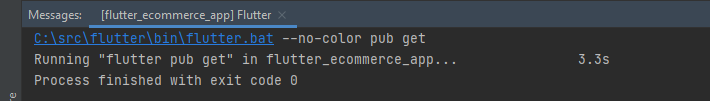
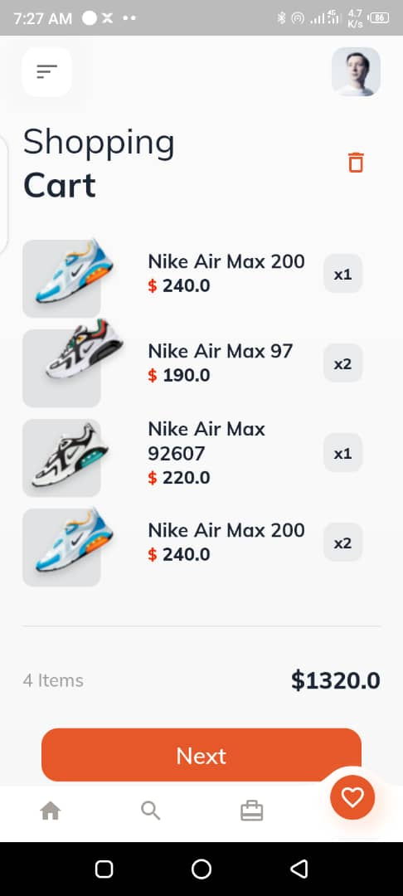
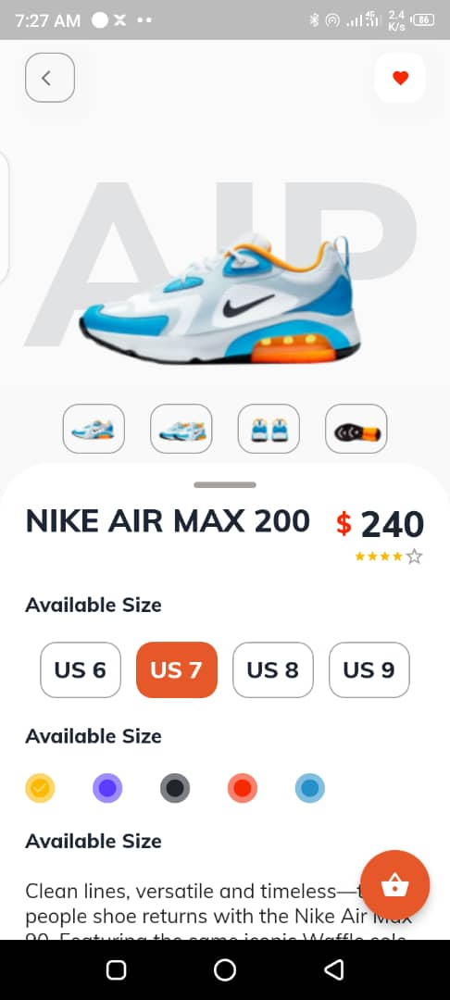
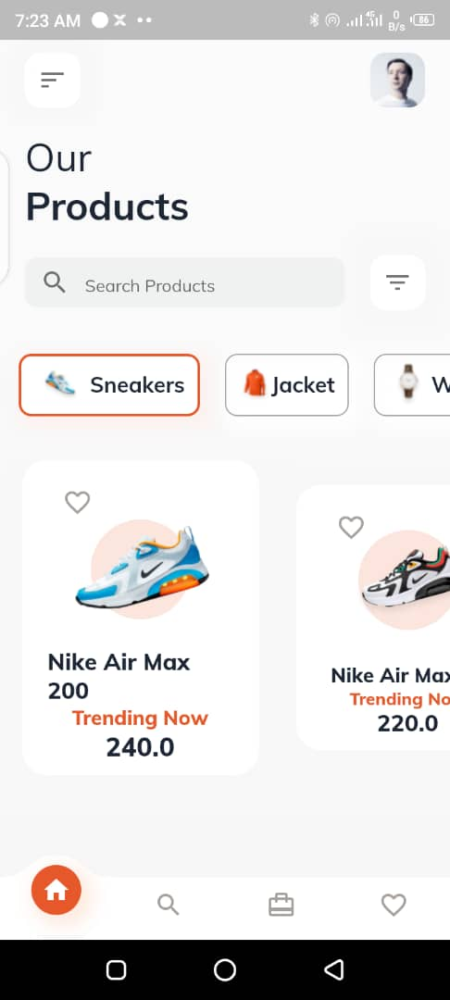

  

<h3 align="center">ShoeShop</h3>
 

## Project Overview

ShoeShop is an ecommerce app for buying of shoes, its built with flutter, it has a beautiful and responsive user interface which gives detailed information about a particular item available for sale. The author of this project is [TheAlphamerc](https://github.com/TheAlphamerc) 

  
 

## Screens
ShoeShop is a simple ecommerce app with a few screens which are

* Home Page
* Product detail page
* Cart page
* Animated Bottom Navigator
* Smooth Animation

Screenshots of each page can be found below

## Installation

To get the source code on your computer and ready to run, all you have to do is clone the repo by running the git command 

*git clone [URL]*

and installing Flutter on your [windows](https://docs.flutter.dev/get-started/install/windows), [mac](https://docs.flutter.dev/get-started/install/macos) or [Linux](https://docs.flutter.dev/get-started/install/linux) then run pub get to get all the dependency used.

*pub get*

After a succesfull run and you have gotten a 0 exit code as shown below,

  

  

## ScreenShoots
Here are some screenshots of the application taken from an Android device

| home page| product detail| cart|

||||

